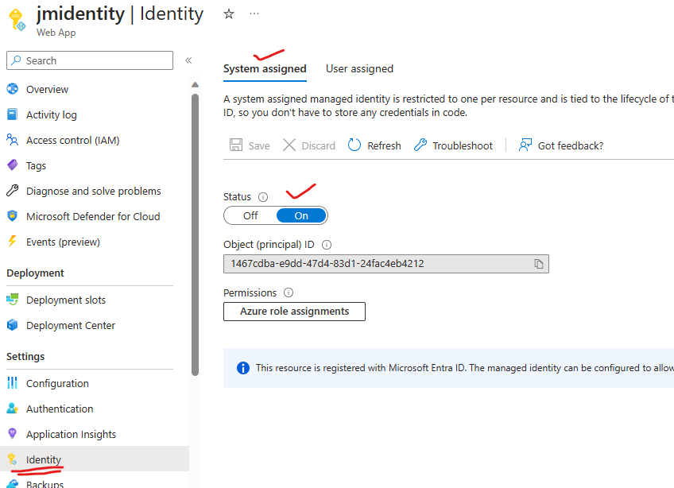
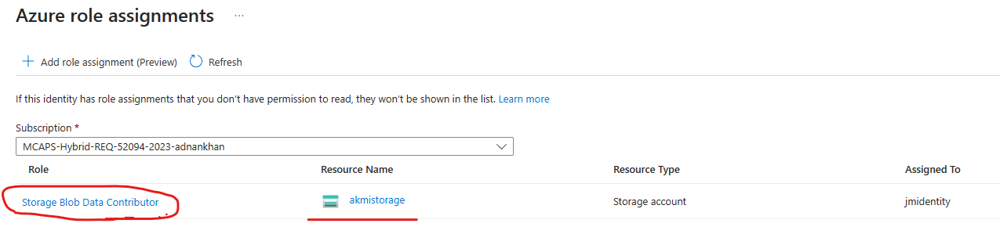
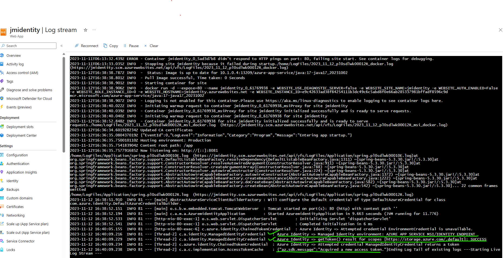

## Managed Identity Blob Storage Sample
This is a sample spring boot application that shows how to upload files to an Azure blob storage account using the Azure BLOB Java SDK, it also illustrates how to create dynamically created SAS tokens using a "User Delegation Key" via a managed identity.

### Prerequisites
- Azure subscription/account
- Azure storage account and a Blob storage container previously created


### Build & deploy the app
1. Update the application.properties file to provide your Azure Blob storage account details
2. Update the maven pom.xml to provide azure app service configuration details, this is needed to use the maven plugin to deploy the application to Azure App Service using mvn commands
4. Run the following command to build the deployable jar
    ```shell
    mvn clean package
    ```
5. Deploy the application to Azure using the following command, this is using the optional maven plugin to deploy to Azure App service, you may also use the Azure CLI to deploy the web app
    ```
    mvn azure-webapp:deploy
    ```
6. Access the application using the **application url** returned in the previous step

### Azure Portal validation
1. Ensure that Managed identity is enabled for your application in Azure App Service as shown below
   ]

2. Ensure the managed identity has the required Azure RBAC Storage account assigned to perform the required operations
   ]

3. You can validate the managed identity tokens are being created by reviewing the logs from the App service dashboard as shown in the below image
   ]


